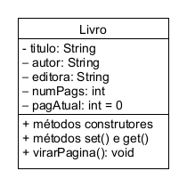
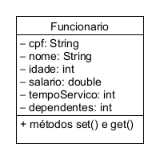

# Conceitos Básicos de Orientação a Objetos

## Exercício 1.1 (CadLivro)

Crie um programa que implemente a classe Livro. Esta classe deve conter o título do livro, nome do autor, editora e quantidade de páginas. Adicione um atributo que
armazene a página atual (paginaAtual), para apresentação em um dispositivo eletrônico de leitura. Crie um método virarPagina, que incrementa o valor armazenado em
paginaAtual. Após isso, crie uma segunda classe chamada Main (classe principal) que conterá o método main. Nesta classe, crie um objeto Livro e preencha seus atributos com
valores lidos do usuário. Após isso, chame o método para virar uma página e apresente o objeto (seu estado) em tela. A classe Livro é apresentada abaixo.

## Exercício 1.2 (ListaLivros)

Usando a classe Livro, criada no exercício anterior, crie uma lista para armazenar diferentes livros. Esta lista pode ser criada usando a coleção ArrayList. Crie um conjunto
de objetos, solicite ao usuário o valor dos seus atributos e armazene-os na lista. Após isso, apresente o título e o número de páginas de cada livro armazenado. Utilize uma 
lista global e diferentes métodos para a criação dos objetos e sua apresentação.

## Exercício 1.3 (ConsultaLivro)

Com base no exercício anterior, crie um método para a consulta de livros. O usuário informa o título do livro desejado, o sistema faz a busca na lista de livros e apresenta
seus dados, caso o encontre. Caso contrário, o sistema deve apresentar a mensagem "Livro não encontrado".

## Exercício 1.4 (ExcluiLivro)

Com base no exercício anterior, crie um método para exclusão de livros. O usuário informa o título do livro que deseja excluir, o sistema faz a busca do livro e o remove da
lista, caso o encontre. Caso contrário, o sistema deve apresentar a mensagem "Livro não encontrado".

## Exercício 1.5 (AlteraLivro)

Com base no exercício anterior, crie um método para alteração de livros. O usuário informa o título do livro que deseja alterar, o sistema faz a busca do livro e, caso o 
encontre, solicita as novas informações ao usuário, atualizando seus campos. Caso contrário. o sistema deve apresentar a mensagem "Livro não encontrado".

## Exercício 1.6 (LivrosCompleto)

Com base nos métodos criados nos exercícios anteriores, crie um programa que apresente ao usuário um menu com todas as opções (cadastro de livro, alteração, exclusão, consulta
por título, consulta completa e sair). O usuário pode selecionar as opções desejadas e, ao terminar, seleciona a opção sair, que finaliza a execução do programa

## Exercício 1.7. (Funcionario)

Crie um programa que implemente a classe Funcionario apresentada abaixo. Na classe principal da aplicação, deverá ser criada uma lista para armazenar os funcionários. Crie
um menu que forneça ao usuário as seguintes operações:

1. Incluir funcionário.
2. Excluir funcionário.
3. Alterar dados de um funcionário.
4. Consultar funcionário pelo CPF.
5. Consultar funcionários por tempo mínimo de serviço.
6. Consultar o salário médio dos funcionários cadastrados.
7. Consultar o total de dependentes dos funcionários cadastrados.

##  Exercício 1.8 (Farmacia)

Crie um programa para gerenciamento de produtos de uma farmácia. Serão implemen
tadas duas classes: Medicamento e Cosmetico. Um medicamento possui uma descrição,
dosagem, nome do laboratório que o fabrica e seu preço. Um cosmético possui uma des
crição, marca, número de lote e preço. Crie as representações dessas classes utilizando
UML. No programa, crie métodos para o cadastro de medicamentos e cosméticos, bem
como a consulta dos registros cadastrados. Crie um método que liste todas as marcas
de cosméticos e a quantidade de cosméticos de cada uma delas. Crie um método para
mostrar os medicamentos com preço maior que a média de preços dos cosméticos.

